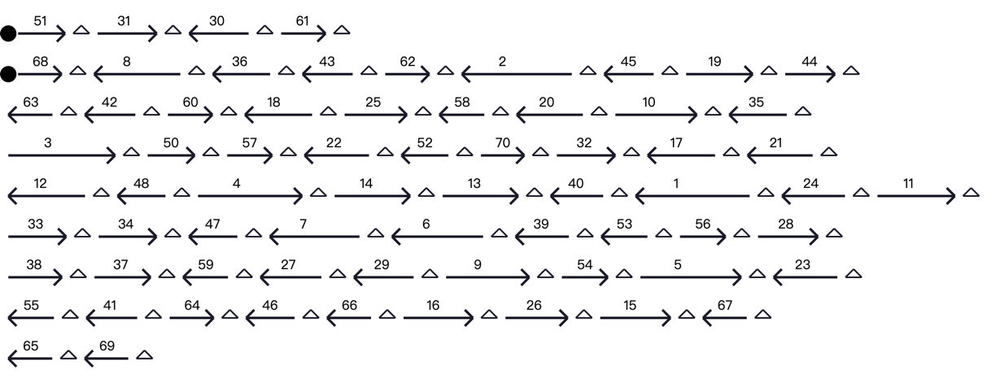

# TELLBASE

###  Contents

------
1. [Description](#description)
2. [Install](#install)
3. [Dependencies](#dep)
4. [Installation](#install)
5. [How to use](#pipeline)
6. [Help](#help)
7. [OutPut](#output)
8. [Copyright Information](#liense)
------

### Description <a name=description></a>

A scaffolding assembly software tool that uses paired-end reads obtained by TELL-Seq technology and contigs generated by SPAdes to fully and accurately assemble bacterial genome in chromosome level.
This tool only uses paired-end reads and barcode information obtained from UST’s TELL-Seq. The input data is named as SAMPLE_R1.fastq, SAMPLE_R2.fastq, SAMPLE_R3.fastq, where SAMPLE_R2.fastq contains the barcode information corresponding to the paired-end reads (SAMPLE_R1.fastq and SAMPLE_R3.fastq).
Notice : only fastq format of reads and barcode sequences is acceptable.

### Dependencies <a name=dep></a>

* Python (3.5)
* cutadapt
* fastp  
* fastqc 
* bwa 
* samtools 
* numpy
* pandas
* scipy
* rpy2
* biopython
* svglib
* svgwrite
* numpy
* pandas
* seaborn

### Installation <a name=install></a>

To install TELLBASE :
```
git clone https://TELLBASE.git
./scripts/install.sh 
```


### How to use <a name=pipeline></a>

The TELLBASE requires three input files:
* Reads file in fastq format `*.fq` 
* i1 、r1 、r2

An example bash script on how to run the TELLBASE :
```
cd ./SeriesAnalysis
python ./main.py --workingSpace yourInputDirectory/ --i1 1326_Ill_R2.fastq --r1 1326_Ill_R1.fastq --r2 1326_Ill_R3.fastq  --num 10000 --c1 3 --c2 2 --outputSpace yourOutputDirectory/
#input、output directory need to created in advance
```
An example to run the TELLBASE with plasmids :
```
cd ./SeriesAnalysis
python ./main.py --workingSpace yourInputDirectory/ --i1 1326_Ill_R2.fastq --r1 1326_Ill_R1.fastq --r2 1326_Ill_R3.fastq  --num 10000 --c1 3 --c2 2 --outputSpace yourOutputDirectory/ --plasmids True
#--plamids 
```


### Help <a name=help></a>
```
usage: main.py [-h] [--coincidenceThreshold COINCIDENCETHRESHOLD] [--coincidenceThreshold_1 COINCIDENCETHRESHOLD_1]
               [--lengthThreshold LENGTHTHRESHOLD] [--workingSpace WORKINGSPACE] [--outputSpace OUTPUTSPACE] [--batch BATCH]
               [--repeatSeriesSpace REPEATSERIESSPACE] [--plasmids PLASMIDS] [--i1 I1] [--r1 R1] [--r2 R2] [--start START] [--num NUM] [--c1 C1]
               [--c2 C2]

SeriesAnalysis_1.0

options:
  -h, --help            show this help message and exit
  --coincidenceThreshold COINCIDENCETHRESHOLD
                        
  --coincidenceThreshold_1 COINCIDENCETHRESHOLD_1
                        
  --lengthThreshold LENGTHTHRESHOLD default: 5000
                        
  --workingSpace WORKINGSPACE
                        
  --outputSpace OUTPUTSPACE
                        
  --plasmids PLASMIDS default: True
  --i1 I1               i1_fastq
  --r1 R1               r1_fastq
  --r2 R2               r2_fastq
  --num NUM  default: 10000. This depends on the DNA fragment fragmentation length of tell-seq. If the fragment fragmentation length is 15000-25000bp, choosing 10000 will have better effect;
  --c1 C1 default: 3
  --c2 C2 default: 2
```
### OutPut<a name=help></a>
* scaffolds_full.fasta : Extended sequence information
```
>1_sequence_length_3410131bp
TTTTCTTTCGTCGGAAATACAATTTGAGTGTACCATAAATGCCTTTTTATTTTTCTAACT
TAATTTTACAATTCGCGAAATTTAAAACAGCTTTGCAGTATCGTGTTATTTATCAAGCCC
>2_sequence_length_1313931bp
GGTTGCTCTTTTCTAACGACGTAAATACTGTCAGCTCTGATGCAGTAATTCCTTGTCTGG
TTTTTATGGGGATACTATCATTTTTAGGGGTAAACACACATTTTAAACTGTTTATTCAAA
```
* rough_path.svg : Rough sequence diagram



* seriesExtended.txt : Extended sequence output diagram
* {outputSpace}/plasmid : this directory include  the sequence information and diagram of plasmids 
### Copyright Information<a name=license></a>
This project is copyrighted by [Author/Organization Name] and was released on [Release Date] with the current version being [Version Number].

This project is licensed under the [License Name] license, which allows you to use this project in any open source or non-commercial project. For more information on this license, please visit [License Link].

If you have any questions or suggestions about this project, please contact us through [Contact Information].


